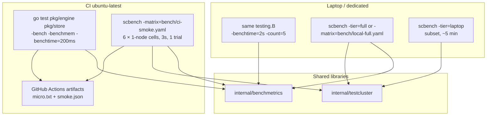
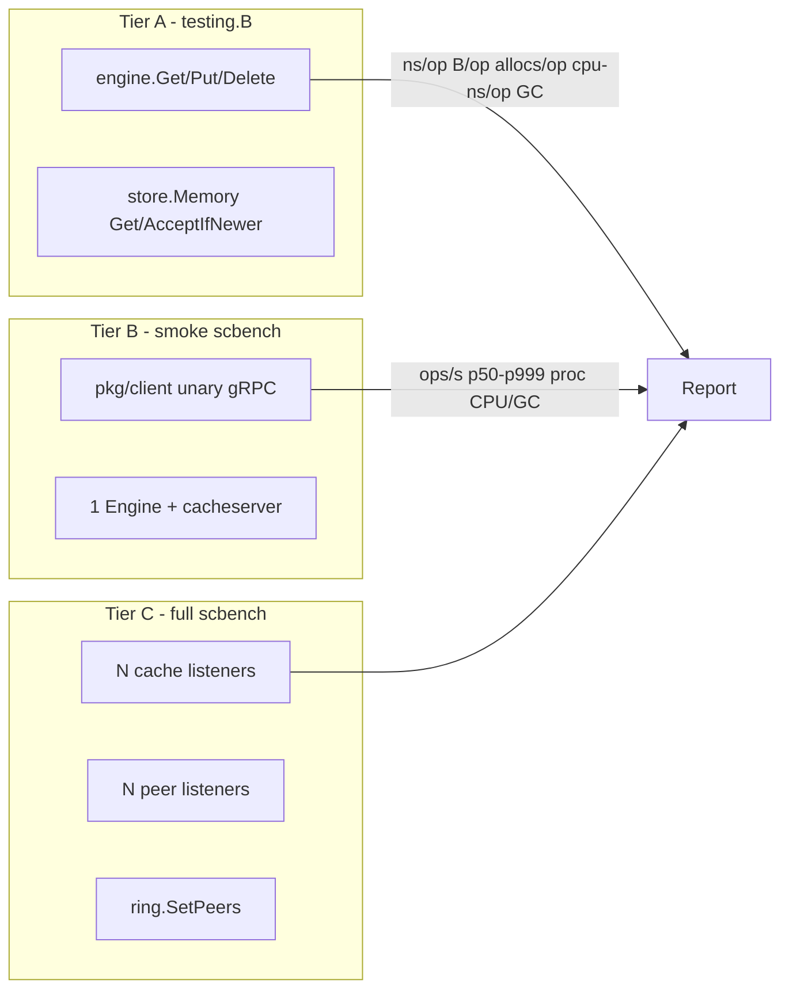
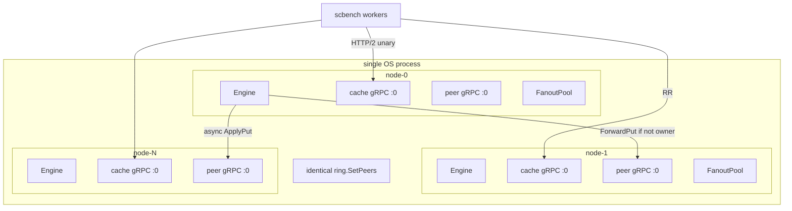

# SuperCache Benchmarking Matrix (CI + Local)

| Field | Value |
|-------|--------|
| **Document** | SuperCache benchmarking matrix |
| **Author** | SuperCache |
| **Date** | 2026-08-08 |
| **Status** | Implemented (rev 3; PR plan below is historical) |
| **Module** | `github.com/Code0987/supercache` |
| **Audience** | SuperCache maintainers |

---

## Overview

SuperCache already has a trustworthy *single-node, remote, CacheOnly-hit* harness in `cmd/scbench` (multi-trial medians, warmup discarded, p50/p95/p99/p999, JSON with `GOMAXPROCS` / `NumCPU` / Go version). It does **not** measure in-process Engine cost, Delete, miss paths, multi-node read-QPS, or CPU/allocs/GC. A naïve 7 ops × 4 client counts × 3 cluster sizes = **84 cells** would be both scientifically sloppy and operationally impossible on GitHub `ubuntu-latest`.

This design splits the work into **three tiers** that share one report schema:

1. **Micro (`testing.B`)** — local `engine.Get` / `Put` / `Delete` (hit, CacheOnly miss, LoadThrough miss with in-memory `DataSource`). Reports ns/op, CPU-ns/op, B/op, allocs/op, GC pause quantiles. CI command uses `-run=^$` so only benches run (~10 s of bench time, not the engine test suite).
2. **Smoke scbench** — **six** 1-node embed cells (get-hit / put / CacheOnly-miss × 1 and 10 workers), 3 s windows, 1 trial. Publishes JSON; **no ops/s regression gate**. A 3-node get-hit smoke cell is added only after `PrefillAll` is tested (PR 8).
3. **Full local matrix** — SuperCache-only, **24 remote cells** (+ optional delete), 1/3/10 in-process nodes via `ring.SetPeers` (no memberlist), 1/10/100/1k workers where those numbers are meaningful. N>1 get-hit is valid only after **every node holds every key** (`PrefillAll` via `ApplyPut`, not async fan-out).

Redis `-compare` stays as today’s 1-node fairness path. The new matrix is SuperCache-only.

---

## Background & Motivation

### Current state

| Surface | What exists | Gap |
|---------|-------------|-----|
| `cmd/scbench/main.go` | Flags: `-concurrency`, `-duration`, `-trials`, `-keys`, `-value-bytes`, `-dist` uniform/zipf, `-warmup`, `-seed`, `-reliable`, `-compare`, `-suite` | Single remote unary gRPC to **one** node; ops = get/set/mixed only |
| `cmd/scbench/load.go` `trialResult` | `OpsPerSec`, `P50`, `P95`, `P99`, `P999`, `Mean`, `Samples`, `Errors` | `aggregateTrials` / `runRecord` **drop P999** (printed per trial, not median-of-trials) |
| `cmd/scbench/backend.go` | `kvStore` = `Get`/`Set`/`Close`; one `client.Dial` shared by all workers | No `Delete`; no multi-addr; no multi-conn |
| `cmd/scbench/report.go` | `suiteReport` has `GOMAXPROCS`, `NumCPU`, `GoVersion` | No process CPU, heap alloc, GC pause |
| `docs/BENCHMARKS.md` | Methodology; fairness vs Redis | Explicitly lists **cluster read-QPS** and **LoadThrough miss** as future |
| `.github/workflows/ci.yml` | `go vet` + `go test ./... -race` | No bench job |
| `pkg/engine` | Public `Get`/`Put`/`Delete`; `AttachCluster`; `Metrics()`; `FanoutStats()` | No `Benchmark*` tests anywhere in the repo |
| `pkg/engine/tls_cluster_test.go` + `pkg/client/client_test.go` | Listen `127.0.0.1:0` → `lis.Addr()` → `SetNodeInfo` → `ring.SetPeers` → `AttachCluster`; cache gRPC on `:0` | `twoNodeCluster` is peer-only, fixed ports, N=2, no Cache port — **not** the embed template |
| `pkg/engine/cluster_test.go` `twoNodeCluster` / `waitFanoutHits` | Peer mesh + `ring.SetPeers`; wait is “≥ some hits on **one** peer” | No 10-node, no cache listeners; wait is not 99% on all nodes |
| `pkg/client.Client` | One `grpc.ClientConn` per `Dial`; HTTP/2 multiplex | 1k “clients” must **not** mean 1k conns by default |
| `pkg/store.Memory.Get` | Copies value (`CloneValue`) under a single mutex | Dominant alloc on the local hit path — store-level bench is worth isolating |
| Recent fan-out hint queue / topology handoff | `FanoutPool.HintsDropped` / `HintsFlushed` on the pool; `Engine.FanoutStats()` is **queue** errors/drops only | testcluster sums the pools it owns; do not claim `Engine.Metrics()` exposes hints |

Today a “reliable” run is:

```bash
go run ./cmd/scbench -reliable -json=bench-report.json
```

which expands to `-compare -suite -trials=5 -duration=20s -warmup=5s -keys=50000` against an **external** `supercache-node` and Redis. That remains the Redis fairness story. It is the wrong shape for Engine CPU/op, miss isolation, or 10-node read-QPS.

### Pain points

- **Wrong tool for CPU/allocs.** `testing.B` is the only honest way to get allocs/op and B/op. Applying those labels to gRPC wall time would be fabricated.
- **Combinatorial waste.** Local Delete on a 10-node cluster does not answer a product question. CacheOnly miss latency barely changes from 1→10 nodes (no SoT, no fan-out). 1k workers on 10 in-process nodes is a scheduler experiment, not a cache experiment.
- **CI honesty.** `ubuntu-latest` is noisy and small. 1k × 10 × 20 s × 5 trials is not a CI job.
- **Put ACK ≠ replicated.** `PLAN.md` §2: owner apply + ACK, **async** full-mesh `ApplyPut`. A 10-node Put bench that ignores `FanoutDropped` will look “fast” while the hint queue melts.

---

## Goals & Non-Goals

### Goals

- Cover the **product-meaningful** cells for:
  - local Get / Put / Delete
  - remote Get / Put
  - cache hit and cache miss
  - 1 / 10 / 100 / 1k workers
  - 1 / 3 / 10 nodes
- Report **ops/sec**, **p50 / p95 / p99 / p99.9**, **CPU/op**, **allocs/op**, **bytes/op**, **GC pause** — each with a defined collection method per tier.
- Run a **short, non-gating** subset on every PR; document a **full** matrix for laptop / dedicated bench machine / optional nightly.
- Reuse `cmd/scbench` trial/median/JSON machinery; add Engine `testing.B` next to the code it measures.
- Keep Redis `-compare` working and labeled 1-node-only.
- Reproducible: pin `GOMAXPROCS`, fixed seed, warmup discarded, ≥3 trials for “reliable”, 1 short trial for CI.
- Cluster benches use **`ring.SetPeers` + peer gRPC + cache gRPC on `127.0.0.1:0`** (same order as `tls_cluster_test.go` / `client_test.go`), **not** memberlist and **not** a copy of `twoNodeCluster` (peer-only, fixed ports).

### Non-Goals

- Formal statistical significance / ANOVA across 84 cells.
- Multi-host or multi-AZ networks; WAN RTT; TLS/mTLS overhead (existing `tls_cluster_test.go` covers correctness).
- Redis Cluster vs SuperCache cluster; Redis pipelining (already labeled unfair in `docs/BENCHMARKS.md`).
- Replication-lag histograms after Put (still a later item in `docs/BENCHMARKS.md`).
- Hard CI fail on **1.5× ns/op** or **2× allocs/op** in v1 (publish artifacts only; gate is PR 9).
- Benchmarking fan-out hint replay, join handoff, or gossip convergence.
- Changing Engine/client public API for the sake of benches.
- Process-per-client or one-OS-process-per-node for the 10-node cell.
- Treating CacheOnly Get as owner-forward. Product Get on CacheOnly is **local-only** (`engine.go` ~256–258); cluster read-QPS is fully-replicated hot-set reads.

---

## Key Decisions

| # | Decision | Rationale |
|---|----------|-----------|
| K1 | **Split matrix, not cartesian.** Three tiers with the recap table as source of truth: **7 CI micro names + 2 local-only cluster3**, **6 CI smoke cells** (1-node), **24 full remote cells** (+ optional delete). Not 84. | Local Delete × 10 nodes is meaningless; CPU/op is a `testing.B` metric; GH runners cannot run the full grid. |
| K2 | **“Client” = worker goroutine.** Default: N workers share **1** `client.Client` (one HTTP/2 conn). Optional `-conns=K` stripes workers across K dials. 1k **connections** is a different experiment and is not the 1k-client cell. Worker `i` uses `pool[addrIdx][i%conns]` with `addrIdx = 0` if sticky else `i%N`. | Matches existing `-concurrency` in `runLoad`. 1k `Dial`s exhaust fds and measure gRPC conn setup, not SuperCache. |
| K3 | **Local = in-process `engine.Get/Put/Delete`.** Remote = `pkg/client` → Cache gRPC (may be localhost / in-process server). | User definition; matches `README.md` Quick start. |
| K4 | **Hit = CacheOnly + prefill. Miss = CacheOnly empty Get or LoadThrough with in-memory DS + unique keys.** Never a real DB. N>1 hit requires `PrefillAll` (K15). | Isolates SuperCache miss machinery. SoT latency would dominate otherwise (`docs/BENCHMARKS.md`). CacheOnly Get never owner-forwards. |
| K5 | **Remote Delete is optional, one full-matrix cell (1-node, 100 workers).** Not in v1 smoke. Local Delete is required in micro. | User listed local Delete and remote Get/Put. `client.Delete` exists — wire it, do not cross with cluster size. |
| K6 | **CPU/allocs/B/op from `testing.B` only for local.** Remote reports **process-level** `runtime/metrics` deltas (`proc_*` JSON keys). Never print `allocs/op` for gRPC. | Mixing the two would be dishonest. Embed process metrics include client+server. |
| K7 | **GC via `runtime/metrics` `/gc/pauses:seconds`.** Fallback `debug.ReadGCStats` only if the histogram is empty. Zero pauses ⇒ report 0 (common at `-benchtime=200ms`). | Go 1.22 (`go.mod`) exposes the histogram. |
| K8 | **10-node = one process, 10 Engines, `127.0.0.1:0`, `ring.SetPeers`.** No gossip. CI smoke is **1-node only** until PR 8. 10-node is **feasible** (tls_cluster × 10) but **not proven** in-repo; first soak is PR 8. | Memberlist on GH is flaky. `twoNodeCluster` does not prove N=10 or Cache ports. |
| K9 | **Start publish-only; no ops/s gate.** Optional later: `benchstat` vs a quiet-machine `testdata/bench/micro-baseline.txt` on **micro only**, fail if ns/op **> 1.5×** or allocs/op **> 2×**. Infra failures (crash, bind, 1-node requireHit, LT `Loads==0`) still exit non-zero. | Hosted runners are noisy. “50%” is ambiguous; the number is **1.5× baseline**. |
| K10 | **Keep `-compare` / `-reliable` behavior unchanged.** `-require-hit` defaults **false**. Matrix get-hit cells set it true. `-matrix` / `-tier` refuse `-compare`. | Prefill-incomplete Redis `Nil` must not start failing today’s compare. |
| K11 | **Do not depend on hint/handoff internals for measurement.** Construction may import `internal/peer` etc. `Engine.FanoutStats()` = Transport queue errors/drops only. `testcluster.FanoutStats()` also sums `FanoutPool.HintsFlushed` / `HintsDropped`. | Hints are not on `telemetry.Snapshot`. No public API change in v1. |
| K12 | **Extract `internal/testcluster` + `internal/benchmetrics`.** Template is `tls_cluster_test.go` + `client_test.go`, not `twoNodeCluster`. PR 4 dogfoods by migrating **one** existing cluster test. | Avoid a third copy of listen/ring/attach; `twoNodeCluster` lacks Cache gRPC. |
| K13 | **YAML matrix (`gopkg.in/yaml.v3`) plus Go presets.** `-tier=smoke\|laptop\|full` works with zero files. If the yaml.v3 PR is rejected, same structs via `encoding/json` — no third format. | YAML is reviewable; one fallback rule, not an open choice. |
| K14 | **Global latency sample cap is exact: `sum(perWorker) == sampleCap` (default 262144).** `base = sampleCap / concurrency`; remainder `+1` on the first `sampleCap % concurrency` workers. No 50 k leftover cap, no 1024 floor. A worker may record 0 samples. | The previous `max(1024, cap/N)` formula made 1k workers collect **1 Mi samples**, violating the cap. |
| K15 | **Cluster get-hit setup = `PrefillAll`: `ApplyPut` the same versioned entry on every Engine.** Measurement still uses `pkg/client`. Do not rely on async fan-out for setup. | CacheOnly Get is local-only. Client Put ACKs the owner only. `waitFanoutHits` is not 99% on all nodes. |
| K16 | **One `testcluster.Start`/`Close` per matrix cell.** Both `bench` (CacheOnly) and `benchlt` (LoadThrough + in-memory DS) are registered when any cell in the process needs LT; embed ignores `-keyspace=demo` and picks by `path`. | Reusing a prefilled cluster turns the next miss cell into a hit. `UpdateKeySpace` wipes the store but **preserves** `lastVer`. |
| K17 | **LoadThrough miss: `seq` on the cell across warmup+trials; `benchlt.MaxBytes = 1<<20`; `WithMaxVersionKeys(65536)`.** Never pair a 64 MiB store with a 65 k lastVer cap. Tier A LT is `e.Get` on a **fixed** key with `MaxBytes=1` (fill cannot stick). Not `ForceLoad`. Working remote LT is PR 5 (embed only). | Unique keys call `nextVersion` → `pruneLastVerLocked`. If live items > cap, every later op does O(cap) `Peek`s under `verMu` while `ΔLoads` still passes. `ForceLoad` on a live key is refresh-ahead (PLAN §7 skip `AcceptIfNewer`), not Get-miss. |

---

## Proposed Design

### Architecture



### Tier responsibilities



### Definitions (normative)

#### Local vs remote

| Kind | Call path | Server process |
|------|-----------|----------------|
| **Local** | `eng.Get` / `eng.Put` / `eng.Delete` | None. Optional `AttachCluster` for 3-node *local* Put/Delete (peer gRPC still happens for fan-out / sync delete). |
| **Remote** | `client.Client.Get/Put/Delete` → `internal/cacheserver.Server` → Engine | Same OS process in `-embed` (default for matrix). External `supercache-node` only for today’s `-sc-addr` / `-compare`. |

Loopback gRPC is still **remote**. “Localhost” is not “local.”

#### Client

```
clients      = -concurrency  (worker goroutines in runLoad)
connections  = -conns        (default 1; each is client.Dial)
```

- One `Client` is one `grpc.ClientConn` (`pkg/client/client.go` `Dial`).
- **Default for every matrix cell: `-conns=1`.**
- **Locked pool mapping** (2D, not “prefer worker index or atomic RR”):

```
pool[addrIdx][connIdx]  // connIdx in [0, conns), addrIdx in [0, N)
addrIdx = sticky ? 0 : (workerID % N)
connIdx = workerID % conns
```

  `openSCPool` dials `N * conns` clients. `runLoad` passes `workerID` into each op. Redis keeps today’s `PoolSize = concurrency`.
- Document a *connection-scaling* appendix cell (optional, not in v1 matrix): 100 workers × 100 conns on 1 node, labeled `conns=100`.

#### Hit vs miss

CacheOnly `Get` after a local store miss returns `ErrNotFound` immediately (`pkg/engine/engine.go` ~256–258). It never owner-forwards. PLAN.md §2: reads are served from **local observation** on the node that was queried.

| Label | Keyspace | Prefill | Op | Success |
|-------|----------|---------|----|---------|
| `get` / hit | CacheOnly `bench` | yes — **`PrefillAll` when `nodes>1`** (see Cluster hit setup); 1-node may use client Put | Get | value returned; `ErrNotFound` is an **error** iff `requireHit` |
| `miss` / cacheonly | CacheOnly `bench` | **no** (fresh empty store for this cell) | Get keys that were never written | `ErrNotFound` / `Found=false` is **success** |
| `miss` / loadthrough | LoadThrough `benchlt` | no cache; in-memory DS always returns `value` | Get **unique** keys (`seq`) | value returned; `engine_metrics.Loads` delta ≥ 0.9 × ops |

`mixed` does **not** set `requireHit` (sets create keys; gets may miss). Today’s swallow of `ErrNotFound` / `redis.Nil` stays for `mixed` and for `-op=get` when `-require-hit=false`.

**LoadThrough miss isolation (required, embed only — PR 5):**

Product `Get` on LoadThrough **fills** the store (`loadThrough` → `nextVersion` → `AcceptIfNewer`). Reusing a 50 k key space becomes a hit bench. Unique keys grow `ks.lastVer`. `pruneLastVerLocked` (`engine.go` ~605–624) is cheap **only** when `Peek` finds keys already LRU-evicted. If live items **exceed** the lastVer cap, the first prune loop deletes nothing and every later op pays **O(cap) `Peek`s under `verMu`**. `ΔLoads` still passes. MaxBytes does not cap `lastVer`.

`entryCost ≈ len(key) + len(value) + 64` (`store/memory.go`). At 256 B values that is ~336 B/entry. **`MaxBytes = 64<<20` holds ~180 k items > 65 536** — that pairing is **forbidden** for LT.

Normative procedure (remote / scbench):

1. Register keyspace `benchlt` at `testcluster.Start` with `ModeLoadThrough`, `NegativeTTL = 0`, `LoadTimeout = 0`, no rate limit, **`MaxBytes = 1 << 20`** (not 64 MiB), `DataSource` = `datasource.Func` that copies a fixed `[]byte` (no sleep). Live set ≈ 1 MiB / 336 B ≈ **3 k items**, well below the lastVer cap, so the first prune loop hits evicted keys in ~O(1) expected `Peek`s. Fill still succeeds (`cost < MaxBytes`).
2. Construct every embed Engine with `engine.WithMaxVersionKeys(65536)` as a **safety rail**, not as the primary bound. **Invariant:** `MaxBytes / entryCost ≤ MaxVersionKeys / 4`. Do not set `MaxVersionKeys` to “expected unique ops” while leaving a 64 MiB store (that is the other rejected pairing: prune never runs, lastVer RAM grows without bound).
3. `loadConfig.seq` is an `atomic.Int64` on the **cell**, not inside `runLoad`. Warmup and every trial **continue** `seq`. Reset only when the cell starts (new cluster). Key = `fmt.Sprintf("%s%d", prefix, seq.Add(1))`.
4. Report `sot: "memory"`. After the measure window, sum `Engine.Metrics().Loads` across nodes; **infra-fail** if `ΔLoads < 0.9 × ops`.
5. Between LT trials keep `seq` going (required). `UpdateKeySpace` alone **preserves** `lastVer`. Do not “fix” prune by raising MaxBytes.

`ForceLoad` is **not** on `pkg/client` and is **not** the remote miss op. Remote LT cannot run against an external `supercache-node`. `-op=miss -miss-mode=loadthrough` without `-embed` is a **flag error**.

**Tier A LT** (`BenchmarkEngineGetMissLoadThrough`): product **`e.Get`**, not `ForceLoad`.

`ForceLoad` (`cluster.go` ~458–485) always calls `loadThrough` (DS + `RecordLoad`). After the first successful fill, `loadThrough` hits PLAN §7 (`engine.go` ~348–351): a live non-negative entry is returned **without** `nextVersion` / `AcceptIfNewer`. Ops 2…`b.N` are refresh-ahead, not Get-miss, and they skip `singleflight` `"get:"+key` / `RecordGet("miss")`. `Loads` still increases, so that assert does not catch the mistake.

Locked micro:

1. 1-node Engine, keyspace `benchlt`, in-memory `datasource.Func`, **one fixed key** `"k"`.
2. **`MaxBytes = 1`** (must be `> 0`; `≤ 0` is unbounded). `entryCost` of a 256 B value is ~336, so `AcceptIfNewer` **always** returns false; `loadThrough` still returns the DS copy (`engine.go` ~364–365).
3. Timed op is **`e.Get`**. Every op is store-miss (nothing sticks) + singleflight + DS + failed fill. `lastVer` stays **one** key; prune never runs. Do **not** unique-key `b.N`.
4. Assert `Loads` increases **and** `store.Stats().Items == 0` (or equivalent) after the loop. Fatal if a value is cached.

Do **not** add `BenchmarkEngineForceLoad` in v1 (refresh-ahead is not the requested miss cell).

CacheOnly miss reuses the existing key RNG, never writes, and runs on a cluster that this cell just `Start`ed (empty store). `bench` (CacheOnly) keeps `MaxBytes = 64<<20`.

#### Cluster hit setup (normative for every N>1 get-hit cell)

**Fact:** client `Put` returns after the **owner** applies; `fanoutPut` async-`Submit`s `ApplyPut` to N−1 peers and **drops** when the 10_000 queue is full (`FanoutPool.Submit`). Sticky get-hit does **not** avoid this: only ~1/N keys are owned by node 0; the rest miss until fan-out lands. Existing `waitFanoutHits` (`cluster_test.go` ~1254) waits for *some* hits on *one* Engine, not 99% on **all** nodes.

**Preferred (locked for embed):** `testcluster.Cluster.PrefillAll`.

```go
// PrefillAll writes the same versioned entry to every node, bypassing fan-out.
// Measurement still uses pkg/client.
func (c *Cluster) PrefillAll(ctx context.Context, ks, prefix string, n int, value []byte) error
```

For `i := 0..n-1`, `key = prefix+strconv.Itoa(i)`, `ent = store.Entry{Value: clone(value), Version: 1, ExpireAt: 0}` (no TTL). Call `eng.ApplyPut(ks, key, ent)` on **every** `Node.Engine`. Same version everywhere so LWW is a no-op if a stray fan-out arrives. Do **not** use `Put` / `PutLocal` for setup (those enqueue fan-out and mint per-node versions via `nextVersion`).

After PrefillAll:

1. **Verify:** for each node, `Engine.Get` every key if `n ≤ 5000` (smoke), else a deterministic sample of 1000 keys (`i = 0, n/1000, 2n/1000, …`). Require **100%** hits. Fail the cell (infra) if any miss. This is setup, not a performance gate.
2. **Idle 50 ms** so a leftover hint flush from the Start ping (if any) is quiet. PrefillAll itself does not enqueue jobs.
3. Then warmup + measure via `pkg/client`. `requireHit=true` for get-hit.

**Not used for v1 setup:** client prefill + drain (`FanoutDropped==0` and `Items ≥ 0.99×keys` on each node + re-Put misses). That is A7’s rejected alternative — slower, racy with `Submit` drops, and `waitFanoutHits` is the wrong helper.

**What cluster read-QPS measures:** fully replicated hot-set local Gets after `PrefillAll`, clients RR’d across Cache addrs. It does **not** measure owner-forward reads.

#### Delete

- **Local Delete (micro):** prefill `keys` entries. Timed loop only calls `Delete`. **Batch-restore every `keys` ops** with `b.StopTimer()` / `b.StartTimer()` around a refill of the whole set. Do **not** `StopTimer` per Delete (timer ops are tens of ns on a sub-µs path and contaminate ns/op). `ops/s` (and `b.N`) count Deletes only; wall time **includes** restore, which is documented.
- **Remote Delete (optional, 1-node full cell only):** same pattern in `runLoad` — after every `keys` successful Deletes, restore those keys **outside** the per-op `t0`/`Since` (latency excludes restore; ops/s wall clock includes it). Not in smoke. Not crossed with 3/10 nodes (`TestClusterDeleteMultiPeer` already covers sync `ApplyDelete`).

#### Cluster size

| N | How | CI smoke (PR 7) | Local full / laptop |
|---|-----|-----------------|---------------------|
| 1 | `testcluster` N=1 (Engine + cache gRPC `:0`; peer listen optional) | yes (6 cells) | yes |
| 3 | `testcluster` 3 Engines, 3 cache, 3 peer, `ring.SetPeers`, `PrefillAll` for get-hit | **no** (added in PR 8 once `PrefillAll` is tested) | yes (selected ops) |
| 10 | same × 10 | no | get-hit + put only (PR 8 soak first) |

Workers on N>1 use the locked mapping above. `-sticky` forces `addrIdx=0` (single entry node + owner **forward on Put** + fan-out). Sticky get-hit is still a local-hit bench **only** because `PrefillAll` put the key on node 0 too.

### Sensible matrix (the actual grid)

#### Tier A — Engine / store microbenches

Files:

- `pkg/store/bench_test.go` — isolate LRU mutex + `CloneValue`
- `pkg/engine/bench_test.go` — public Engine API

Naming (stable for `benchstat`):

| Benchmark name | What | Parallel | CI | Local `-count=5` |
|----------------|------|----------|----|------------------|
| `BenchmarkStoreGetHit` | `store.Memory.Get` after fill, 256 B | `b.N` + `b.RunParallel` sub | yes | yes |
| `BenchmarkStorePut` | `AcceptIfNewer` with **monotonic `Version++` each op** (equal/lower version is `staleSkip`, not a put) | both | yes | yes |
| `BenchmarkEngineGetHit` | CacheOnly prefill, `e.Get` | `BenchmarkEngineGetHit` + `BenchmarkEngineGetHitParallel` | yes | yes |
| `BenchmarkEngineGetMissCacheOnly` | empty keyspace, expect `ErrNotFound` | seq + parallel | yes | yes |
| `BenchmarkEngineGetMissLoadThrough` | 1-node, in-memory DS, **`e.Get` on one fixed key, `MaxBytes=1`** (fill cannot stick) | seq + parallel | yes | yes |
| `BenchmarkEnginePut` | CacheOnly `e.Put` overwrite (Engine mints versions) | seq + parallel | yes | yes |
| `BenchmarkEngineDelete` | Delete + **batch restore every `keys` ops** (`StopTimer` around the batch only) | seq | yes | yes |
| `BenchmarkEnginePutCluster3` | `testcluster` N=3, `nodes[0].Put` | seq only | **no** | yes |
| `BenchmarkEngineDeleteCluster3` | N=3 sync delete | seq only | **no** | yes |

**Not in micro:** 10-node, 1k clients, remote gRPC, zipf, mixed.

**Fixed parameters for Engine benches (except LT, noted above):**

- Keyspace `bench`, `MaxBytes = 64 << 20`, `TTL = time.Hour` (no expiry during bench)
- `keys = 10_000`, `value = 256` bytes (same alphabet fill as scbench)
- `context.Background()`
- `b.ReportAllocs()`
- `b.SetBytes(int64(len(value)))` on Get-hit / Put so `MB/s` is meaningful
- After the timed loop: `internal/benchmetrics` snapshot → `b.ReportMetric`:
  - `cpu-ns/op`
  - `gc-p50-ns`, `gc-p99-ns` (0 if no GC in the window — **expected** at `-benchtime=200ms`)
  - `gc-frac` (pause total / `b.Elapsed()`)
- Parallel benches: one `Read()` just after `ResetTimer`, one after `RunParallel` returns and `StopTimer` — **not** per worker.
- `GOMAXPROCS` left to the runner; CI pins 2 via `env`.

Local 3-node Engine Put is the **only** micro view of fan-out CPU. It will allocate more (entry clone per peer in `fanoutPut`). That is the point.

#### Tier B — CI smoke scbench (6 cells in PR 7)

| # | op | hit/miss | nodes | concurrency | conns | duration | warmup | trials | notes |
|---|----|----------|-------|-------------|-------|----------|--------|--------|-------|
| 1 | get | hit | 1 | 1 | 1 | 3s | 1s | 1 | `requireHit`; 1-node client or `PrefillAll` |
| 2 | get | hit | 1 | 10 | 1 | 3s | 1s | 1 | |
| 3 | set | — | 1 | 1 | 1 | 3s | 1s | 1 | |
| 4 | set | — | 1 | 10 | 1 | 3s | 1s | 1 | |
| 5 | miss | cacheonly | 1 | 1 | 1 | 3s | 1s | 1 | fresh cell / empty store |
| 6 | miss | cacheonly | 1 | 10 | 1 | 3s | 1s | 1 | |

Shared: `keys=5000`, `value-bytes=256`, `dist=uniform`, `seed=42`, `-embed`, loader forces `-collect-runtime`, `-gomaxprocs=2`.

**Not in PR 7 smoke:** 3-node get-hit, LoadThrough, Delete. PR 8 may append cell 7 `{op: get, path: hit, nodes: 3, concurrency: 10}` once `PrefillAll` is unit-tested.

**Budget:** 6 × 4 s + 1-node start ≈ **30 s**. Plus micro with `-run=^$` ≈ 10–20 s. If the job exceeds 3 min, drop nothing from these 6; investigate tests leaking into the bench command.

LoadThrough miss is **not** in CI smoke (unique-key allocs + fill; needs embed LT from PR 5 and is a local/full cell).

#### Tier C — full local remote matrix (scbench)

Defaults: `keys=50000`, `value-bytes=256`, `dist=uniform`, `seed=42`, `warmup=5s`, `duration=15s`, `trials=3`, `-embed`, `-collect-runtime`, `-conns=1`. Dedicated machine may raise `trials=5` and `duration=20s` via `-reliable-matrix` (does **not** turn on `-compare`).

**1-node (12 cells) — latency + concurrency scaling**

| op | clients |
|----|---------|
| get-hit | 1, 10, 100, 1000 |
| set | 1, 10, 100, 1000 |
| miss-cacheonly | 1, 10, 100 |
| miss-loadthrough | 10 |
| delete (optional) | 100 |

Skip miss @ 1k: unique-key LoadThrough at 1k workers is an allocator bench; CacheOnly miss at 1k is redundant with 100.

**3-node (8 cells) — cluster read-QPS + owner-forward Put**

| op | clients | notes |
|----|---------|-------|
| get-hit | 1, 10, 100 | RR across 3 cache addrs |
| set | 10, 100 | expect fan-out CPU; record `FanoutDropped` |
| miss-cacheonly | 10 | sanity; should ≈ 1-node miss |
| miss-loadthrough | 10 | owner `GetOrLoad` + fan-out fill |
| get-hit sticky | 100 | all workers → node 0; contrast with RR |

Skip 1k on 3-node for v1 (scheduler noise in one process).

**10-node (4 cells) — read scale-out and Put fan-out cost**

| op | clients | notes |
|----|---------|-------|
| get-hit | 10, 100 | **the** cluster read-QPS cells |
| set | 10, 100 | **high risk**: 9 `ApplyPut`s/write; report drops; do not treat as “slow Engine” |

Skip: miss, delete, 1 client (uninteresting), 1k clients (one process, 10 gRPC servers, 1k goroutines — not a product number).

**Laptop preset (`-tier=laptop`, ~5–8 min)**

| op | nodes | clients | trials | duration | warmup |
|----|-------|---------|--------|----------|--------|
| get-hit | 1 | 1, 10, 100 | 3 | 8s | 2s |
| set | 1 | 10, 100 | 3 | 8s | 2s |
| miss-cacheonly | 1 | 10 | 3 | 8s | 2s |
| get-hit | 3 | 10 | 3 | 8s | 2s |
| set | 3 | 10 | 3 | 8s | 2s |

**Cell count recap (source of truth)**

| Tier | Count | Contents |
|------|------:|----------|
| A micro (CI) | 7 names | Store Get/Put; Engine Get-hit, Get-miss CacheOnly, Get-miss LT (`e.Get` + `MaxBytes=1`), Put, Delete. Parallel variants are extra `Benchmark*` functions in the same job, not extra cells. |
| A micro (local only) | +2 | `BenchmarkEnginePutCluster3`, `BenchmarkEngineDeleteCluster3` |
| B smoke (PR 7) | **6** | 1-node get-hit / put / miss-cacheonly × {1, 10} workers |
| B smoke (PR 8+) | +1 optional | 3-node get-hit, 10 workers, after `PrefillAll` test |
| C full remote | **24** | 1-node 12 + 3-node 8 + 10-node 4 |
| C full optional | +1 | 1-node delete @ 100 workers |
| C laptop | 8 | Human-time subset of C |

84 cartesian → **6 smoke + 24 full + 7 CI micro names**. Overview, K1, and this table must match.

### In-process cluster harness

New package `internal/testcluster`:

```go
package testcluster

type Config struct {
    Nodes     int                 // 1, 3, or 10
    Keyspaces []keyspace.Config   // see defaults below
    Fanout    peer.FanoutConfig   // zero → Workers=32, QueueSize=10_000 (NewFanoutPool / supercache-node)
    VNodes    int                 // zero → 32
    MaxVersionKeys int            // zero → 65536 (bench default; not production 1e6)
}

type Node struct {
    ID        string
    Engine    *engine.Engine
    CacheAddr string // host:port after listen
    PeerAddr  string
}

type FanoutCounters struct {
    Errors, Dropped   uint64 // Transport queue (Engine.FanoutStats)
    HintsFlushed      uint64 // FanoutPool.HintsFlushed
    HintsDropped      uint64 // FanoutPool.HintsDropped
}

type Cluster struct {
    Nodes []Node
}

func Start(cfg Config) (*Cluster, error)
func (c *Cluster) Close()
func (c *Cluster) CacheAddrs() []string
func (c *Cluster) PrefillAll(ctx context.Context, ks, prefix string, n int, value []byte) error
func (c *Cluster) VerifyLocalHits(ctx context.Context, ks, prefix string, n, sample int) error
func (c *Cluster) FanoutStats() FanoutCounters // sum of pools + transports testcluster owns
func (c *Cluster) Metrics() []telemetry.Snapshot
```

**Default keyspaces** when `cfg.Keyspaces` is empty and the caller is scbench embed:

- `bench`: CacheOnly, `MaxBytes=64<<20`, `TTL=time.Hour`
- `benchlt`: LoadThrough, **`MaxBytes=1<<20`** (not 64 MiB), `NegativeTTL=0`, `LoadTimeout=0`, in-memory `datasource.Func` (only registered if this cell’s `path` is `miss-loadthrough`). **Per-cell Start** means only `benchlt` for an LT cell, only `bench` otherwise.

Engine options: `engine.New(engine.WithMaxVersionKeys(65536))` (or `cfg.MaxVersionKeys` if set). **Invariant on `benchlt`:** `MaxBytes / 336 ≤ MaxVersionKeys / 4` at the default 256 B value. A unit test in `internal/testcluster` or `pkg/engine` (`TestLTLastVerPruneCheap`) must `Get` ≥ 200 k unique LT keys with this pairing and assert `nextVersion` / `Get` stay well under 1 ms after the cap (no O(cap) Peek storm). The forbidden control is 64 MiB + 65 536.

**Construction order (mandatory)** — copy `tls_cluster_test.go` (peer `:0` → `lis.Addr()` → `SetNodeInfo` → ring → attach) plus `client_test.go` (cache `:0`). Do **not** clone `twoNodeCluster` (fixed ports, no cache server, no `SetNodeInfo`).

1. `eng := engine.New(engine.WithMaxVersionKeys(...))`; `UpdateKeySpace` each cfg.
2. `cgs, clis := cacheserver.ListenAndServe("127.0.0.1:0", eng)` and `pgs, plis := peerserver.ListenAndServe("127.0.0.1:0", eng)`. On listen error, retry 3×. Record `CacheAddr=clis.Addr().String()`, `PeerAddr=plis.Addr().String()`.
3. `eng.SetNodeInfo(id, peerAddr)` **after** bind (TLS test does this).
4. After **all** nodes are listening, `peers := []ring.Peer{{ID, Addr: peerAddr}}`; each `ring.New(vnodes).SetPeers(peers)`.
5. `tr := peer.NewTransport(time.Second)`; `fo := peer.NewFanoutPool(tr, cfg.Fanout)`; `eng.AttachCluster(&engine.Cluster{SelfID, Ring, Transport: tr, Fanout: fo})`. Keep `*FanoutPool` on the `Cluster` so `FanoutStats` can read hint counters.
6. No `pkg/membership`, no admin HTTP, no warmup manager.

**Readiness:** `client.Dial` each `CacheAddr` and issue `Get` on a missing key (`Found=false` is success). **Do not** ping-`Put` a bench key (that dirties one owner only). Close the ping clients.

**`Close()` order** (reverse of start; matches tls_cluster defers):

1. Each `Fanout.Close()`
2. Each `Transport.Close()`
3. Each cache `grpc.Server.Stop()` and peer `Stop()`
4. Each `Engine.Close()`

**Lifecycle vs matrix:** **one Start/Close per cell** (K16). 1-node start is milliseconds. Do not reuse a cluster across a hit cell and a miss cell.

**N=10:** first appearance is a `testcluster` soak test in PR 8 (`TestStartClose10`, `t.Parallel` unused in this repo — keep it off). Not claimed proven by N=2/3 peer-only tests.



**Fan-out sizing for 10-node Put:** keep production defaults (`Workers: 32`, `QueueSize: 10_000` from `cmd/supercache-node/main.go`). Do **not** disable hints (`DisableHints` stays false) — we want dropped/flushed counters to show up when Put outruns the mesh. If 100-client Put on 10 nodes is unusable, the report says so; we do not silently enlarge the queue to make the number pretty.

### scbench changes

#### New / changed flags (`cmd/scbench/main.go`)

| Flag | Default | Meaning |
|------|---------|---------|
| `-embed` | false | Start `testcluster` in-process; ignore `-sc-addr` for SuperCache |
| `-nodes` | 1 | Cluster size when `-embed` |
| `-sticky` | false | All workers dial `CacheAddrs()[0]` |
| `-conns` | 1 | Independent `client.Dial`s (per target addr) |
| `-concurrency` | 64 | Workers (“clients”). Unchanged name |
| `-op` | get | `get` \| `set` \| `mixed` \| `delete` \| `miss` |
| `-miss-mode` | cacheonly | `cacheonly` \| `loadthrough` (only for `-op=miss`) |
| `-tier` | "" | `smoke` \| `laptop` \| `full` — runs preset matrix |
| `-matrix` | "" | YAML file of cells (see below) |
| `-collect-runtime` | **false** | Sample `runtime/metrics` per trial. **Loader forces true** when `-tier` or `-matrix` is set. |
| `-require-hit` | **false** | Get `ErrNotFound` counts as error. Forced **true** for matrix/tier get-hit cells. **Off** for `-compare` / `-reliable` / `mixed`. |
| `-gomaxprocs` | 0 | `runtime.GOMAXPROCS(n)` if >0 |
| `-sample-cap` | 262144 | Max latency samples per trial (**exact global sum**) |
| `-reliable-matrix` | false | trials≥5, duration≥20s, warmup≥5s, keys≥50k; SuperCache-only |

Existing `-compare`, `-suite`, `-reliable`, `-sc-addr`, `-redis-addr` stay. Invariants:

- `-tier` or `-matrix` ⇒ SuperCache embed (unless every YAML cell sets `embed: false` + `addr`) ⇒ **error if `-compare`**. Loader sets `-collect-runtime`.
- `-op=miss` implies no prefill; `-op=get` + `-prefill=false` is accepted but the report `path` field becomes `miss-cacheonly`.
- `-miss-mode=loadthrough` without `-embed` (or matrix `embed: true`) is a **fatal flag error** (DataSource is server-side).
- `-require-hit` is the only way Get treats `ErrNotFound` as error. Default false preserves `-compare` / `-reliable`.
- Embed ignores CLI `-keyspace=demo` and uses `bench` or `benchlt` from the cell `path`.

#### `kvStore` extension (`backend.go`)

```go
type kvStore interface {
    Name() string
    Get(ctx context.Context, key string) ([]byte, error)
    Set(ctx context.Context, key string, val []byte) error
    Delete(ctx context.Context, key string) error // new; redis: DEL
    Close() error
}
```

New SuperCache opener for embed/matrix:

```go
func openSCPool(ctx context.Context, addrs []string, keyspace string, connsPerAddr int) (*scPool, error)
```

`scPool` holds `clients [][]*client.Client` shaped `[len(addrs)][conns]`. Methods take `workerID int`:

```
addrIdx := workerID % len(addrs) // 0 if sticky (pool built with addrs[:1] or a sticky flag)
connIdx := workerID % conns
```

`runLoad` is updated to pass `workerID` (the `w` index). No atomic RR.

Redis path: implement `Delete` (`DEL`) for interface completeness. **`-suite` stays get/set/mixed only.**

#### `runLoad` changes (`load.go`)

- Add `op == "delete"` and `op == "miss"`.
- `requireHit` only when the flag/cell says so (not for mixed, not for default CLI get).
- LoadThrough: use `cfg.seq` (`*atomic.Int64`); **do not** create a new counter inside `runLoad` (warmup would reset it).
- Sample cap — extract `func sampleCapPerWorker(cap, concurrency int) []int` with tests:

```
// sum(out) == cap; out[i] = cap/concurrency or +1 for the first rem workers.
// concurrency=1, cap=262144 → [262144]
// concurrency=100 → 44 workers with 2622, 56 with 2621 (example) summing to 262144
// concurrency=1000, cap=262144 → 144 workers with 263, 856 with 262; 0 is allowed if cap < concurrency
```

  Drop the 50_000 per-worker leftover and the 1024 floor.
- Delete: batch restore every `cfg.keys` successful Deletes, **outside** `t0`/`Since`. Document that ops/s wall time includes restore.
- Do not add mutexes on the hot path (keep per-worker `workerBuf`).

#### Matrix runner lifecycle (`matrix.go`)

For each cell, in order:

1. `cluster, err := testcluster.Start(...)` with keyspaces for **this** cell only (`bench`, plus `benchlt` if path is LT).
2. `openSCPool` on `cluster.CacheAddrs()` (or `[0:1]` if sticky).
3. If path is get-hit and `nodes>1`: `PrefillAll` + `VerifyLocalHits`. If `nodes==1`: `PrefillAll` on the single Engine (same helper) or client prefill — **use `PrefillAll` even for N=1** so one code path.
4. Warmup `runLoad` (discard result); **do not** reset `seq`.
5. For each trial: `benchmetrics.Read()`; measure `runLoad`; `Read()`; delta; `engine_metrics` = sum of `cluster.Metrics()` after − snapshot before (take before-measure snapshots too).
6. `pool.Close()`; `cluster.Close()`.

Add `TestMatrixHitThenMissDoesNotHit` in `cmd/scbench` (or `internal/testcluster`): Start → PrefillAll → simulated hit Gets succeed → Close → Start new cluster → CacheOnly miss Gets return not-found (no leftover keys). This is the Issue 2 guard.

#### Exit criteria (split; K9)

| Class | Examples | Process exit |
|-------|----------|--------------|
| **Infra fail (CI red)** | panic; bind failure; invalid YAML; embed Dial/Get ping failure; `PrefillAll`/`VerifyLocalHits` failure; **1-node** get-hit `requireHit` / `Hits==0`; LT `ΔLoads < 0.9×ops`; `-miss-mode=loadthrough` without embed | non-zero |
| **Soft fail (JSON + stderr + `$GITHUB_STEP_SUMMARY`, exit 0)** | 3-node get-hit requireHit or verify timeout **if** we ever run that cell before PrefillAll is trusted; `FanoutDropped > 0` on a **Put** cell; error rate 0–0.1% on non-requireHit cells | 0 |
| **Not a fail** | ops/s, p99, `proc_*` vs last week; `gc-p50-ns=0` | 0 |

v1 smoke is 1-node only, so get-hit `requireHit` in CI is “prefill bug” (infra), not a noisy perf gate. 3-node smoke, when added, uses the same `PrefillAll` path and is infra if verify fails.

#### Report schema (`report.go`)

Add median-of-trials **P999** (bugfix). Extend records:

```go
type procMetrics struct {
    CPUSeconds      float64 `json:"proc_cpu_seconds"`
    CPUNsPerOp      float64 `json:"proc_cpu_ns_per_op"`
    AllocBytes      uint64  `json:"proc_alloc_bytes"`
    AllocObjects    uint64  `json:"proc_alloc_objects"`
    AllocBytesPerOp float64 `json:"proc_alloc_bytes_per_op"`
    AllocsPerOp     float64 `json:"proc_allocs_per_op"` // NEVER json:"allocs/op"
    GCPauseP50Ns    int64   `json:"gc_pause_p50_ns"`
    GCPauseP99Ns    int64   `json:"gc_pause_p99_ns"`
    GCPauseTotalNs  int64   `json:"gc_pause_total_ns"`
    GCFraction      float64 `json:"gc_fraction"`
    GCCycles        uint64  `json:"gc_cycles"`
}

type engineDelta struct {
    Gets, Hits, Misses, Loads, Puts, Deletes uint64
}

type runRecord struct {
    // existing fields...
    MedianP999      time.Duration `json:"median_p999_ns"`
    Nodes           int           `json:"nodes"`
    Conns           int           `json:"conns"`
    Sticky          bool          `json:"sticky"`
    Path            string        `json:"path"` // get-hit | get-miss-cacheonly | get-miss-loadthrough | put | delete | mixed
    Embed           bool          `json:"embed"`
    SOT             string        `json:"sot,omitempty"` // "memory" | ""
    MedianProc      procMetrics   `json:"median_proc"` // field-wise median of trial Proc
    EngineMetrics   engineDelta   `json:"engine_metrics"` // embed-only; zero on -sc-addr
    FanoutErrors    uint64        `json:"fanout_errors"`
    FanoutDropped   uint64        `json:"fanout_dropped"`
    HintsFlushed    uint64        `json:"hints_flushed"`
    HintsDropped    uint64        `json:"hints_dropped"`
}

type suiteReport struct {
    SchemaVersion int    `json:"schema_version"` // 2 when these fields land
    GitSHA        string `json:"git_sha,omitempty"`
    GOOS          string `json:"goos"`
    GOARCH        string `json:"goarch"`
    Tier          string `json:"tier,omitempty"`
    EmbedNote     string `json:"embed_note,omitempty"`
    // existing GeneratedAt, GOMAXPROCS, GoVersion, NumCPU, Note, Runs
}
```

`trialResult` gains `Proc procMetrics`, `Engine engineDelta`, and keeps `P999`.

**Median aggregation:** extend `aggregateTrials` to also median `P999` and **each** `procMetrics` numeric field independently (same even/odd rule as `medD` / `med`). `EngineMetrics` on `runRecord` is the **median-of-trials** of each counter (or last-trial is wrong — use median). Fan-out counters: **max** across trials (a drop in any trial is the signal).

**GitSHA:** `os.Getenv("GITHUB_SHA")` if non-empty; else `debug.ReadBuildInfo()` `Settings` `vcs.revision`; else omit.

**`printRunSummary`:** add `p999=%s` on the latency line (today it only prints p50/p95/p99). Print process stats as `proc_cpu_ns/op=…  proc_allocs/op=…  gc-frac=…` — never the token `allocs/op`. Print `fanout_drop=` / `hints_drop=` when embed.

`envNote()` sets `SchemaVersion: 2` and `EmbedNote` to:

> Process CPU/alloc/GC (`proc_*`) include client workers and all in-process nodes. These are **not** `testing.B` allocs/op.

`engine_metrics` is **embed-only**. External `-sc-addr` cannot see `Engine.Metrics()` (no admin scrape in v1); leave zeros.

### Matrix YAML

`gopkg.in/yaml.v3` is a **direct** module require (used only by `cmd/scbench`). Decision rule (K13): ship YAML; if that PR is rejected over the dep, switch the same structs to `encoding/json` and rename files to `*.json`. No dual format.

`bench/ci-smoke.yaml` (checked in; `-tier=smoke` embeds the same struct so CI can run without the file, but CI should pass `-matrix=bench/ci-smoke.yaml` to test the loader). **PR 7 file has 6 cells — no 3-node row:**

```yaml
# bench/ci-smoke.yaml
tier: smoke
gomaxprocs: 2
trials: 1
duration: 3s
warmup: 1s
keys: 5000
value_bytes: 256
dist: uniform
seed: 42
embed: true
collect_runtime: true
conns: 1
cells:
  - { op: get,  path: hit,                 nodes: 1, concurrency: 1 }
  - { op: get,  path: hit,                 nodes: 1, concurrency: 10 }
  - { op: set,  path: put,                 nodes: 1, concurrency: 1 }
  - { op: set,  path: put,                 nodes: 1, concurrency: 10 }
  - { op: miss, path: miss-cacheonly,      nodes: 1, concurrency: 1 }
  - { op: miss, path: miss-cacheonly,      nodes: 1, concurrency: 10 }
```

PR 8 may append `- { op: get, path: hit, nodes: 3, concurrency: 10 }` after `PrefillAll` is tested. `local-full.yaml` / `laptop.yaml` may include N>1 cells as soon as PR 5 lands (those files are not CI).

`bench/local-full.yaml` lists every Tier C cell. `bench/laptop.yaml` lists the laptop preset.

Loader: `cmd/scbench/matrix.go` — defaults at file level, per-cell overrides, validate op/path/nodes/concurrency.

### Runtime / GC collection (`internal/benchmetrics`)

```go
package benchmetrics

type Snapshot struct {
    Wall          time.Time
    CPUSeconds    float64
    AllocBytes    uint64
    AllocObjects  uint64
    GCPauseHist   []float64 // bounds + counts, or pre-digested
    GCPauseTotal  time.Duration
    GCCycles      uint64
}

func Read() Snapshot
func Delta(before, after Snapshot, wall time.Duration, ops int64) ProcStats
```

Metrics (Go 1.22 names):

| Metric | Use |
|--------|-----|
| `/cpu/classes/user:cpu-seconds` + `/cpu/classes/system:cpu-seconds` | process CPU |
| `/cpu/classes/gc/mark/pause:cpu-seconds` | optional split |
| `/gc/heap/allocs:bytes` | monotonic alloc bytes |
| `/gc/heap/allocs:objects` | monotonic alloc objects |
| `/gc/cycles/total:gc-cycles` | cycle count |
| `/gc/pauses:seconds` | `metrics.Float64Histogram` → p50/p99 of **individual pauses** (not of the window) |

Algorithm:

1. `Read()` before warmup? No — **before the measure window only** (after warmup), so warmup GC is excluded.
2. `Read()` after `runLoad` returns.
3. Histogram delta: the runtime histogram is **cumulative**. Subtract counts per bucket (same bounds; document if Go ever changes buckets).
4. p50/p99 from the **delta** histogram (pauses that occurred during the window). If fewer than 1 pause, report **0** for `gc-p50-ns` / `gc-p99-ns` and `gc_cycles=0`. CI `-benchtime=200ms` will often see this — document in `docs/BENCHMARKS.md` so it is not treated as a broken sampler.
5. `gc_fraction = gc_pause_total / wall`.
6. `cpu_ns_per_op = (cpu_seconds / ops) * 1e9`.
7. `proc_allocs_per_op = float64(alloc_objects) / float64(ops)` — process-level only.

`testing.B` helper (wall = `b.Elapsed()`, Go 1.20+; module is 1.22):

```go
func Report(b *testing.B, before, after Snapshot) {
    b.Helper()
    st := Delta(before, after, b.Elapsed(), int64(b.N))
    b.ReportMetric(st.CPUNsPerOp, "cpu-ns/op")
    b.ReportMetric(float64(st.GCPauseP50.Nanoseconds()), "gc-p50-ns")
    b.ReportMetric(float64(st.GCPauseP99.Nanoseconds()), "gc-p99-ns")
    b.ReportMetric(st.GCFraction, "gc-frac")
}
```

Call sequence: setup (untimed) → `before := Read()` → `b.ResetTimer()` → loop or `b.RunParallel` → `b.StopTimer()` → `Report(b, before, Read())`. For `RunParallel`, `Read` wraps the **whole** parallel section, not each worker.

**Do not** use `testing.AllocsPerRun` for remote. **Do not** divide `MemStats.Mallocs` by gRPC ops and call it `allocs/op` in the same column as `go test -benchmem`.

Fallback: if `/gc/pauses:seconds` is unavailable, `debug.ReadGCStats` (`PauseQ` is not a true histogram; use `PauseTotal` + last `Pause` slice for a coarse p50/p99). Implement behind the same API.

### Sequence: one remote get-hit trial

```mermaid
sequenceDiagram
    participant M as scbench main
    participant TC as testcluster
    participant W as workers
    participant C as client.Client
    participant S as cacheserver
    participant E as engine.Engine
    participant BM as benchmetrics

    M->>TC: Start(nodes=N)  // per cell; Close after cell
    TC->>S: Listen 127.0.0.1:0 (cache+peer)
    M->>C: Dial pool (conns=1)
    M->>TC: PrefillAll (ApplyPut every Engine)
    M->>TC: VerifyLocalHits
    M->>W: warmup runLoad (discard; seq continues)
    M->>BM: Read()
    M->>W: measure runLoad(duration)
    loop each op
        W->>C: Get
        C->>S: unary Get
        S->>E: Get (CacheOnly hit)
        E-->>S: value copy
        S-->>C: Found=true
    end
    M->>BM: Read(); Delta
    M->>TC: FanoutStats / Metrics
    M-->>M: trialResult + procMetrics
```

### How to run

#### CI (every PR)

```bash
# Micro — never combine with -race; -run=^$ skips Test* (cluster/handoff/chaos).
GOMAXPROCS=2 go test ./pkg/store ./pkg/engine \
  -run=^$ \
  -bench='Benchmark(Store|Engine)' \
  -benchmem -benchtime=200ms -count=1 \
  -timeout=5m \
  | tee micro.txt

# Smoke matrix (6 × 1-node cells)
go run ./cmd/scbench -matrix=bench/ci-smoke.yaml -json=smoke.json
```

`scripts/bench-ci.sh` **is** those two commands (plus `set -euo pipefail`). PR 7 must not invent a different `go test` line.

#### Local laptop

```bash
# Engine numbers you can trust more
GOMAXPROCS=$(nproc) go test ./pkg/store ./pkg/engine \
  -run=^$ \
  -bench='Benchmark(Store|Engine)' \
  -benchmem -benchtime=2s -count=5 \
  -timeout=30m \
  | tee micro-local.txt

# Optional: benchstat vs a previous file
# go install golang.org/x/perf/cmd/benchstat@latest
# benchstat testdata/bench/micro-baseline.txt micro-local.txt

# ~5–8 min SuperCache remote subset
go run ./cmd/scbench -tier=laptop -json=laptop.json

# Full matrix (quiet machine, ~25–40 min at trials=3 / 15s)
go run ./cmd/scbench -tier=full -json=full.json

# Dedicated publishable
go run ./cmd/scbench -tier=full -reliable-matrix -json=full.json
```

#### One-off cells

```bash
# Remote get-hit, 100 workers, 3 in-process nodes
go run ./cmd/scbench -embed -nodes=3 -op=get -prefill \
  -concurrency=100 -conns=1 -trials=3 -duration=15s -warmup=5s \
  -json=out.json

# CacheOnly miss
go run ./cmd/scbench -embed -op=miss -miss-mode=cacheonly -concurrency=10

# LoadThrough miss (in-memory DS)
go run ./cmd/scbench -embed -op=miss -miss-mode=loadthrough -concurrency=10

# Existing Redis compare (unchanged; external processes)
go run ./cmd/scbench -reliable -json=vs-redis.json
```

#### Scripts

- `scripts/bench-ci.sh` — exact CI commands; used by the workflow.
- `scripts/bench-local.sh [laptop|full]` — prints the “quiet machine” checklist from `docs/BENCHMARKS.md` and runs the tier.

---

## API / Interface Changes

No public `pkg/engine` or `pkg/client` API changes.

`cmd/scbench` CLI is the interface. Additions are backward compatible except:

| Change | Impact |
|--------|--------|
| `-require-hit` treats Get `ErrNotFound` as error | Default **false**. Matrix get-hit cells set true. `-compare`/`-reliable` unchanged. |
| New `kvStore.Delete` | Internal to scbench + redis adapter; `-suite` still get/set/mixed |

`internal/testcluster` is importable by tests and scbench only (internal/).

JSON report gains fields; old readers ignore them.

---

## Data Model Changes

No on-disk or wire schema. Report JSON versioning: add `suiteReport.SchemaVersion = 2` when new fields land so dashboards can detect median_p999 / proc metrics.

No baseline file in v1. When a gate is added later:

```
testdata/bench/micro-baseline.txt   # benchstat format, checked in
testdata/bench/README.md            # how to refresh (manual, dedicated machine)
```

Refresh is a dedicated PR, not an automatic CI rewrite (CI is too noisy to be the source of truth).

---

## Alternatives Considered

### A1. Full 84-cell cartesian product in one `scbench -suite-all`

- **Pros:** Simple to specify; nothing “left out.”
- **Cons:** Hours on a laptop; CI fiction; many cells are not identified (local Delete × 10 nodes; CacheOnly miss × cluster size; 1k × 10).
- **Rejected** in favor of the split tables.

### A2. Only `testing.B` for everything, including remote

- **Pros:** One tool; allocs/op for free.
- **Cons:** `testing.B` wants a tight loop around a function, not a 15 s multi-worker gRPC load; `b.N` calibration fights long trials; CPU/op would still include the test binary’s client.
- **Rejected** for Tier B/C. Keep `testing.B` for Engine/store.

### A3. Multi-process 10× `supercache-node` + memberlist for “realism”

- **Pros:** Includes gossip and separate heaps.
- **Cons:** 30 ports (cache+peer+gossip), flaky seeds on GH, harder embed in CI, 10× GOMAXPROCS fighting. `docs/BENCHMARKS.md` already warns this is not multi-AZ truth.
- **Rejected** for the matrix. Document as a **manual** experiment in an appendix (optional later).

### A4. 1k independent gRPC connections as the definition of “1k clients”

- **Pros:** Looks like 1k app replicas.
- **Cons:** SuperCache apps are expected to use long-lived `Client`s (`pkg/client`); HTTP/2 multiplex is the real path; 1k conns is an fd/port test.
- **Rejected** as default. Offered via `-conns`.

### A5. Hard CI gate on day one (`benchstat` + 10% threshold)

- **Pros:** Catches accidental O(n) allocs on Get.
- **Cons:** `ubuntu-latest` p99 and even ns/op wander >10% week to week; false reds.
- **Rejected** for v1. **Accepted later** on **micro only**, **> 1.5× ns/op** or **> 2× allocs/op**, after a checked-in baseline from a quiet machine. Smoke stays publish-only (ops/s never gates).

### A6. Shared library `pkg/bench` instead of `internal/*`

- **Pros:** External users could embed SuperCache benches.
- **Cons:** We do not want to support that API; would freeze harness details.
- **Rejected.** `internal/testcluster` + `internal/benchmetrics`.

### A7. Cluster get-hit prefill: `ApplyPut` every Engine vs client Put + fan-out wait

- **Client Put + drain:** matches the production write path; wait until each node has ≥99% keys; re-Put misses. **Cons:** Put ACK is owner-only; `Submit` drops when the queue is full; `waitFanoutHits` only waits for *some* hits on *one* peer; 50 k keys × 10 nodes is a long, racy setup; 3-node CI smoke would flake or mix misses.
- **`PrefillAll` (`ApplyPut` same `Version: 1` on every Engine):** bypasses fan-out for **setup only**; measurement still uses `pkg/client`. Deterministic; one code path for N=1 and N>1.
- **Pick: `PrefillAll`.** Cluster read-QPS is defined as fully-replicated local Gets. Replication-lag after Put remains a documented non-goal.

### A8. One `Start`/`Close` per matrix cell vs reuse one cluster

- **Reuse:** faster for 10-node. **Cons:** a get-hit cell prefills `bench`; the next miss-cacheonly cell with the same prefix is a hit bench. Reset via `UpdateKeySpace` wipes the store but **keeps `lastVer`**. Easy to get wrong in the runner.
- **Per cell:** 1-node start is cheap; 10-node start is once per cell (~24 cells, only 4 are 10-node). Isolation is trivial. `TestMatrixHitThenMissDoesNotHit` is a Close/Start test.
- **Pick: one Start/Close per cell (K16).**

### A9. Smoke job frequency

- Every PR (chosen): catches embed/prefill regressions in <1 min extra CI. Hosted-runner noise is acceptable because there is **no ops/s gate**.
- Nightly-only smoke: would let a broken `PrefillAll` sit on `main` all day. Optional `workflow_dispatch` / nightly is for **full** matrix, not smoke.

---

## Security & Privacy Considerations

| Topic | Handling |
|-------|----------|
| Threat model | Benches bind `127.0.0.1` only; plaintext gRPC like other tests. |
| Auth | No TLS, no gossip secret. Do not copy production `-cluster` flags. |
| Data | Synthetic keys `scbench:{i}`, alphabet payload. No user data. |
| CI artifacts | JSON + text contain machine stats (NumCPU, Go version). No secrets. Do not add hostname if it ever includes private fleet names; `os.Hostname` is optional and off by default in CI. |
| Resource abuse | Smoke caps duration and nodes so a PR cannot start 10 nodes × 1k workers on GitHub. |

---

## Observability

### During a run

- Existing per-trial stdout: ops/s, err, p50/p95/p99/**p999**, samples.
- New: `proc_cpu_ns/op`, `gc-p50`, `gc-frac`, `fanout_err/drop`, `hints_drop`, `path=`.
- `engine_metrics` (`engineDelta`) on each `trialResult` / `runRecord`: embed-only. Snapshot **after warmup, before measure** and **after measure**, sum across nodes, store the delta. Field-wise median across trials on `runRecord`.
- Exit criteria: see the infra vs soft table under scbench changes. 1-node get-hit `Hits==0` / `requireHit` and LT `Loads` too low are **infra**. ops/s is never a fail.

### CI

- Upload `micro.txt` and `smoke.json` as Actions artifacts (14-day retention).
- Job summary: paste the smoke comparison table (markdown) via `$GITHUB_STEP_SUMMARY`.

### Alerting / gate (v2)

- Not in v1.
- Future: `benchstat testdata/bench/micro-baseline.txt micro.txt` parsed for `~` vs `+`; fail if Engine Get-hit ns/op > 1.5× or allocs/op > 2×.
- scbench smoke never gates on ops/s (noise).

### Logging

- scbench stays `fmt.Printf`, not zap.
- `testcluster` start logs node ID + bound addrs at info; silence peer fan-out errors already counted in `FanoutErrors`.

---

## Rollout Plan

### Feature flags / presets

| Knob | Default | CI | Local full |
|------|---------|----|------------|
| `-embed` | false (keeps today’s external-node flow) | true via YAML | true |
| `-tier` / `-matrix` | off | `bench/ci-smoke.yaml` | `full` or YAML |
| `-collect-runtime` | false for legacy one-off; true in YAML | true | true |
| `-compare` | unchanged | not used in bench job | optional separate command |

### Staged implementation

See **PR Plan**. Each PR is mergeable: tests pass without the next PR.

### Rollback

- Bench job is `continue-on-error: false` only for **process crash / non-zero `go test`**. If smoke becomes flaky (port bind), pin `continue-on-error: true` temporarily — still upload artifacts — rather than deleting the job.
- `-require-hit` defaults false, so reverting it is unnecessary for `-compare`. Matrix-only behavior lives in YAML.

### Compatibility

- `go test ./... -race` must stay green; new benches are `*_test.go` and are **not** run without `-bench`.
- Do not add `//go:build bench` unless a bench import becomes heavy; current design uses stdlib + existing internals.

---

## Risks

| Risk | Sev | Mitigation |
|------|-----|------------|
| Noisy GitHub runners (CPU steal, p99 lies) | **High** | Smoke is publish-only; short windows labeled `tier=smoke`; pin `GOMAXPROCS=2`; never `-race` on benches. |
| 1k goroutines + 50k samples/worker OOM or p999 bias | **Med** | Exact global cap: `sum(perWorker)==262144`; no 1024 floor. |
| 10-node Put fan-out dominates / drops | **High** | Only 10 and 100 clients; report queue drops **and** `HintsDropped` via `testcluster.FanoutStats()` (not `Engine.Metrics()`); label Put as **owner-ACK latency**. |
| In-process 10 nodes share one GOMAXPROCS / heap | **Med** | Document: numbers are **not** 10 VMs. |
| Port exhaustion / bind flakes | **Low** | `127.0.0.1:0`; retry listen 3×. PR 7 has no 3-node cell. |
| LoadThrough cell secretly becomes hit | **High** | Cell-scoped `seq` across warmup+trials; per-cell Start; `ΔLoads ≥ 0.9×ops`. |
| LT unique keys become a `lastVer` prune storm | **High** | **`benchlt.MaxBytes=1<<20`** so live ≪ 65 536; cap is a rail only. Forbidden: 64 MiB + 65 k. `TestLTLastVerPruneCheap` (≥200 k unique Gets). `ΔLoads` does **not** catch this. |
| Tier A LT measures refresh-ahead, not Get-miss | **High** | `e.Get` + fixed key + `MaxBytes=1`; not `ForceLoad`. Assert store `Items==0`. |
| N>1 get-hit mixes misses | **High** | `PrefillAll` + `VerifyLocalHits`; do not use client Put + `waitFanoutHits`. |
| Hit cell secretly includes misses (1-node) | **Med** | Matrix sets `requireHit`; infra-fail if `Hits==0`. |
| Embed CPU/op includes client | **Med** | `proc_*` JSON names; Engine `testing.B` is the source of truth for allocs/op. |
| `runtime/metrics` histogram bucket change across Go versions | **Low** | Delta by bound value not index; CI is `1.22.x`. |
| Adding `yaml.v3` to go.mod | **Low** | cmd-only; fallback to JSON only if that PR is rejected. |
| Fan-out workers steal CPU from Get-hit on 10 nodes | **Med** | `PrefillAll` does not enqueue; 50 ms idle; Get-hit should not enqueue puts. |
| CI time budget / accidental Test* in bench job | **Med** | `-run=^$` in `scripts/bench-ci.sh`; smoke is 6 × 1-node; 3-node is not in the job to drop. |

---

## Open Questions

1. **Include the 3-node smoke cell in every PR?** **Resolved: not in PR 7.** Add in PR 8 after `PrefillAll` + `VerifyLocalHits` are unit-tested.
2. **Check in `testdata/bench/micro-baseline.txt` in the micro PR or wait?** **Resolved: wait.** Quiet-machine `-benchtime=2s -count=5` only; never use CI output as a benchstat baseline. Gate remains PR 9.
3. **YAML dependency vs JSON matrix?** **Resolved: YAML (`gopkg.in/yaml.v3`).** Fallback to JSON only if that PR is rejected (K13).
4. **Should `-tier=full` include one zipf get-hit cell (1-node, 100 workers)?** **Resolved: yes** as an extra optional cell in `local-full.yaml`, not part of the headline 24.
5. **Value-size sweep (64 / 256 / 4 KiB)?** Out of v1 matrix; `-value-bytes` remains for one-offs. 256 B stays the default.
6. **Remote Delete in smoke?** **Resolved: no.** Optional 1-node / 100-worker full-matrix cell only.

---

## References

- `cmd/scbench/main.go`, `load.go`, `report.go`, `backend.go`, `cmd/scbench/README.md`
- `docs/BENCHMARKS.md` (methodology; future cluster QPS / LoadThrough miss)
- `pkg/engine/engine.go` (`Get`/`Put`/`Delete`, `loadThrough`, `singleflight`)
- `pkg/engine/cluster.go` (`PutLocal`, `fanoutPut`, `FanoutStats` = Transport queue only, owner forward; `ForceLoad` is refresh-ahead — **not** the Get-miss bench)
- `pkg/engine/tls_cluster_test.go` + `pkg/client/client_test.go` (embed listen-`:0` template)
- `pkg/engine/cluster_test.go` `twoNodeCluster` / `waitFanoutHits` (peer-only; **not** the harness template; wait is not all-node 99%)
- `pkg/engine/engine.go` `WithMaxVersionKeys`, `nextVersion`, `pruneLastVerLocked`, `UpdateKeySpace` (wipes store, keeps `lastVer`)
- `pkg/client/client.go` (`Dial`, unary Get/Put/Delete)
- `pkg/datasource/datasource.go` (`Func`, `Map`)
- `pkg/store/memory.go` (`Get` copies under mutex)
- `pkg/telemetry/telemetry.go` (`Snapshot`, hit/miss/load counters)
- `internal/cacheserver/server.go`, `internal/peerserver/server.go`
- `internal/peer/transport.go` `FanoutConfig` / `FanoutPool`
- `internal/ring/ring.go` `SetPeers`
- `cmd/supercache-node/main.go` (production fan-out defaults, gossip — **not** used by matrix)
- `PLAN.md` §2 (async fan-out, N × hot set, read-QPS scale-out)
- `.github/workflows/ci.yml`
- Go 1.22 `runtime/metrics` (`/gc/pauses:seconds`, `/cpu/classes/*`, `/gc/heap/allocs:*`)

---

## File / package map

```
pkg/store/bench_test.go              # NEW  store micro
pkg/engine/bench_test.go             # NEW  engine micro (1-node + optional cluster3)
internal/benchmetrics/runtime.go     # NEW  runtime/metrics snapshot + histogram delta
internal/benchmetrics/runtime_test.go
internal/testcluster/cluster.go      # NEW  N-node in-process cluster + PrefillAll
internal/testcluster/cluster_test.go # Start/Close/Dial + PrefillAll/Verify + hit-then-miss
cmd/scbench/main.go                  # EDIT flags, tier dispatch
cmd/scbench/load.go                  # EDIT ops, sample cap, requireHit
cmd/scbench/backend.go               # EDIT Delete, pool, multi-addr
cmd/scbench/report.go                # EDIT MedianP999, procMetrics, schema v2
cmd/scbench/matrix.go                # NEW  YAML + presets
cmd/scbench/cluster.go               # NEW  thin wrap of testcluster + keyspaces
cmd/scbench/README.md                # EDIT
bench/ci-smoke.yaml                  # NEW
bench/laptop.yaml                    # NEW
bench/local-full.yaml                # NEW
scripts/bench-ci.sh                  # NEW
scripts/bench-local.sh               # NEW
docs/BENCHMARKS.md                   # EDIT tiers, tables, how to run
.github/workflows/ci.yml             # EDIT add bench job
.github/workflows/bench.yml          # NEW optional workflow_dispatch / nightly
```

---

## PR Plan

Incremental, each PR independently reviewable and mergeable. Do **not** merge embed (PR 5) with CI (PR 7) until `PrefillAll` exists and is tested. Combining 1+2 or 6+7 is fine if diffs stay small.

### PR 1 — Report completeness + runtime sampler

- **Title:** `scbench: median p999 and process runtime/GC metrics`
- **Files:** `cmd/scbench/report.go`, `cmd/scbench/main.go` (wire print), `internal/benchmetrics/runtime.go`, `internal/benchmetrics/runtime_test.go`, `docs/BENCHMARKS.md`
- **Depends on:** none
- **Changes:** Add `MedianP999` to `aggregateTrials` / `runRecord`. **`printRunSummary` must print p999** (today p50/p95/p99 only). Implement `benchmetrics.Read/Delta` with unit tests on monotonic counters. Optional `-collect-runtime` (default false) on the existing 1-node path. `SchemaVersion=2`. `proc_*` JSON names. GitSHA from `GITHUB_SHA` else `ReadBuildInfo`. No matrix yet.

### PR 2 — Engine and store microbenches

- **Title:** `bench: Engine/store testing.B for Get/Put/Delete hit and miss`
- **Files:** `pkg/store/bench_test.go`, `pkg/engine/bench_test.go`, `internal/benchmetrics` (`Report` using `b.Elapsed()`), `docs/BENCHMARKS.md`
- **Depends on:** PR 1 (benchmetrics)
- **Changes:** All Tier A benches **except** cluster3. `BenchmarkStorePut` increments version every op. `BenchmarkEngineGetMissLoadThrough` is **`e.Get` + fixed key + `MaxBytes=1`** (not `ForceLoad`, not unique keys). Delete batch-restores every `keys` ops under `StopTimer`. Parallel: one Read around `RunParallel`. Document `gc-p50-ns=0` at 200ms. `Test` job unchanged (no `-bench`).

### PR 3 — scbench CacheOnly miss, require-hit (off by default), conns, sample cap, Delete

- **Title:** `scbench: CacheOnly miss, -conns, sample cap, -require-hit, Delete`
- **Files:** `cmd/scbench/load.go`, `backend.go`, `main.go`, `cmd/scbench/load_test.go`, `cmd/scbench/README.md`
- **Depends on:** PR 1
- **Changes:** `kvStore.Delete` (Redis `DEL`; `-suite` still get/set/mixed). `-op=miss` with **CacheOnly only** (`-miss-mode=loadthrough` → fatal “needs -embed” even before embed exists, or simply reject unknown mode until PR 5). `-conns`, locked pool mapping (1 addr until PR 5). `-sample-cap` with `TestSampleCap` cases **1 / 100 / 1000** asserting `sum==cap`. `-require-hit` **default false**; when true, Get `ErrNotFound` is an error. Tests: swallow vs requireHit. **No LoadThrough. No behavior change for `-compare`/`-reliable`.**

### PR 4 — In-process cluster harness + PrefillAll

- **Title:** `internal/testcluster: in-process N-node cluster without gossip`
- **Files:** `internal/testcluster/cluster.go`, `cluster_test.go`; optionally migrate **one** existing test (e.g. a 2-node peer test) to `testcluster` so the harness is dogfooded. **Do not** delete `twoNodeCluster` wholesale.
- **Depends on:** none (can parallel PR 1–3)
- **Changes:** `Start/Close/CacheAddrs` for N=1 and N=3. **Cache + peer** on `127.0.0.1:0`; order from `tls_cluster_test.go`. `PrefillAll` + `VerifyLocalHits` tests (every node returns hits). `FanoutStats` includes hint counters from owned pools. `TestHitThenMissIsolated` (Start/prefill/Close/Start/miss). Close order specified. No N=10 yet. No scbench integration.

### PR 5 — scbench embed + PrefillAll + LoadThrough miss

- **Title:** `scbench: -embed cluster, PrefillAll hit setup, LoadThrough miss`
- **Files:** `cmd/scbench/cluster.go`, `backend.go`, `main.go`, `load.go`, `cmd/scbench/README.md`
- **Depends on:** PR 3, PR 4
- **Changes:** `-embed`, `-nodes`, `-sticky`. **Always** `PrefillAll` for get-hit (N=1 and N>1). Multi-addr pool with locked `addrIdx`/`connIdx`. Enable `-miss-mode=loadthrough` **only** with embed (`benchlt` **`MaxBytes=1<<20`** + cell `seq` + `WithMaxVersionKeys(65536)`). Include `TestLTLastVerPruneCheap`. Report `testcluster.FanoutStats()` and embed `engine_metrics`. Manual: `-embed -nodes=3 -op=get -require-hit -concurrency=10 -duration=3s`.

### PR 6 — Matrix YAML + presets + scripts

- **Title:** `scbench: -tier/-matrix runner and bench YAML presets`
- **Files:** `cmd/scbench/matrix.go`, `bench/ci-smoke.yaml` (**6 cells, 1-node only**), `bench/laptop.yaml`, `bench/local-full.yaml` (only cells PR 5 can run: 1/3-node hit/put/miss, LT, sticky; **no 10-node until PR 8**), `scripts/bench-ci.sh` (includes `-run=^$`), `scripts/bench-local.sh`, docs
- **Depends on:** PR 5
- **Changes:** YAML loader + Go presets. **Per-cell Start/Close.** `go test ./cmd/scbench` parses YAML **and** runs `TestMatrixHitThenMissDoesNotHit` (execute two tiny cells, not just parse). Loader forces `-collect-runtime` and get-hit `-require-hit`. No CI workflow yet.

### PR 7 — CI bench job (publish-only, 1-node smoke)

- **Title:** `ci: microbench + scbench smoke artifacts`
- **Files:** `.github/workflows/ci.yml` and/or `.github/workflows/bench.yml`, `scripts/bench-ci.sh`
- **Depends on:** PR 2, PR 6
- **Changes:** Job `bench` on `ubuntu-latest`, `GOMAXPROCS=2`, Go `1.22.x`. Exact micro line from **How to run → CI** (`-run=^$ -timeout=5m`). Smoke: `bench/ci-smoke.yaml` (6 cells). Upload artifacts + step summary. **No benchstat.** **No -race.** Infra-fail only (crash, bind, YAML, 1-node requireHit, ping). **Do not** add 3-node here.

### PR 8 — 10-node soak, cluster3 micro, 3-node smoke, remaining full cells

- **Title:** `bench: cluster3 Engine benches, 10-node soak, optional 3-node smoke`
- **Files:** `pkg/engine/bench_test.go` (cluster3), `internal/testcluster` (`TestStartClose10`), `bench/local-full.yaml` (10-node + remaining cells), optional `bench/ci-smoke.yaml` cell 7, `docs/BENCHMARKS.md`
- **Depends on:** PR 4, PR 6
- **Changes:** `BenchmarkEnginePutCluster3` / `DeleteCluster3`. N=10 `Start` soak (`t.Parallel` off). Add 10-node full-matrix cells. Optionally append 3-node get-hit to smoke now that `PrefillAll` is proven. Document fan-out-dominated Put with an example JSON snippet.

### PR 9 (optional, later) — Micro regression gate

- **Title:** `ci: benchstat gate for Engine Get-hit/Put (1.5× ns/op, 2× allocs)`
- **Files:** `testdata/bench/micro-baseline.txt`, `scripts/bench-ci.sh`, workflow, `testdata/bench/README.md`
- **Depends on:** PR 7 + a human baseline run (`-benchtime=2s -count=5` on a quiet machine — **not** CI output)
- **Changes:** `benchstat`; fail only on Engine Get-hit / Put **ns/op > 1.5×** or **allocs/op > 2×**. scbench smoke remains publish-only.

---

## Appendix: Example Engine bench skeleton

```go
// pkg/engine/bench_test.go
func BenchmarkEngineGetHit(b *testing.B) {
    ctx := context.Background()
    e := engine.New()
    defer e.Close()
    val := bytes.Repeat([]byte("a"), 256)
    _ = e.UpdateKeySpace(keyspace.Config{
        Name: "bench", Mode: keyspace.ModeCacheOnly,
        MaxBytes: 64 << 20, TTL: time.Hour,
    })
    const n = 10_000
    for i := 0; i < n; i++ {
        _ = e.Put(ctx, "bench", fmt.Sprintf("k%d", i), val)
    }
    b.SetBytes(int64(len(val)))
    b.ReportAllocs()
    before := benchmetrics.Read()
    b.ResetTimer()
    for i := 0; i < b.N; i++ {
        _, err := e.Get(ctx, "bench", fmt.Sprintf("k%d", i%n))
        if err != nil {
            b.Fatal(err)
        }
    }
    b.StopTimer()
    benchmetrics.Report(b, before, benchmetrics.Read()) // uses b.Elapsed()
}
```

LoadThrough micro: `datasource.Func`, keyspace `MaxBytes: 1`, timed **`e.Get(ctx, "benchlt", "k")`** on a fixed key (not `ForceLoad`, not unique keys). Fatal if `Loads` does not increase or the store retains the key. Store put micro: `ent.Version++` each `AcceptIfNewer`.

---

## Appendix: What “good” looks like (interpretation, not gates)

| Cell | How to read it |
|------|----------------|
| `BenchmarkEngineGetHit` allocs/op | Dominated by `store.Memory.Get` `CloneValue` (1 alloc) + any metric/span. A jump to 5+ allocs is a real regression. |
| `BenchmarkEngineGetMissCacheOnly` | Should be cheaper than hit (no copy); still takes the store mutex. |
| `BenchmarkEngineGetMissLoadThrough` | `e.Get` miss + in-memory DS + failed fill (`MaxBytes=1`). Includes singleflight + `loadThrough`. **Not** `AcceptIfNewer` success; **not** `ForceLoad` (that would skip fill after op 1). Higher ns/op than CacheOnly miss (DS copy every time). |
| Remote get-hit 1→10→100 workers, 1 node | Throughput should rise then flatten on GOMAXPROCS / mutex. |
| Remote get-hit 100 workers, 1 vs 3 vs 10 nodes (RR) | Reads are **local** after `PrefillAll` (fully replicated hot set). More nodes should increase aggregate QPS until the process is CPU-saturated. If 10 ≈ 1, workers are stuck on one addr or `PrefillAll`/`VerifyLocalHits` was skipped. This is **not** an owner-forward Get bench. |
| Remote put 10 nodes | Latency is owner ACK; throughput may fall vs 1-node because each write clones and enqueues N−1 ApplyPuts. Rising `fanout_dropped` means the number is no longer “the cache,” it is “the queue.” |
| Process `gc_fraction` > ~0.05 on get-hit | Investigate allocs on the hit path (copies, tracing). |

These sentences belong in `docs/BENCHMARKS.md` so published JSON is not misread as marketing.
