# SuperCache cluster flows (N nodes)

Mermaid-only flow diagrams. Render on GitHub or any Mermaid viewer.

---

## Topology

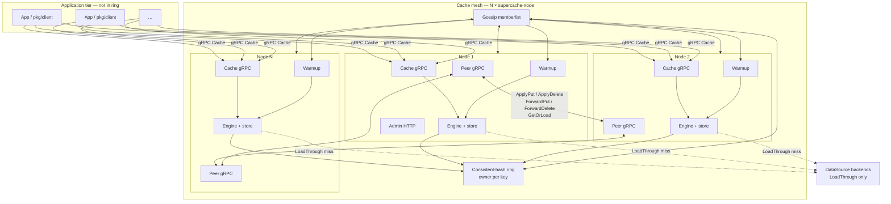

---

## Ownership

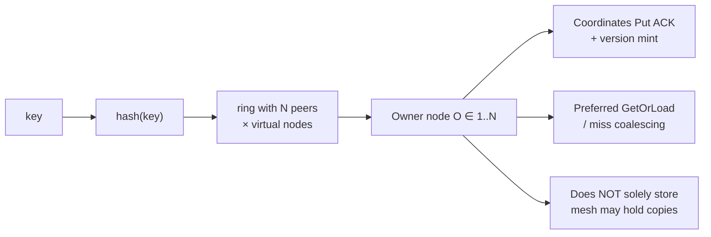

---

## Put

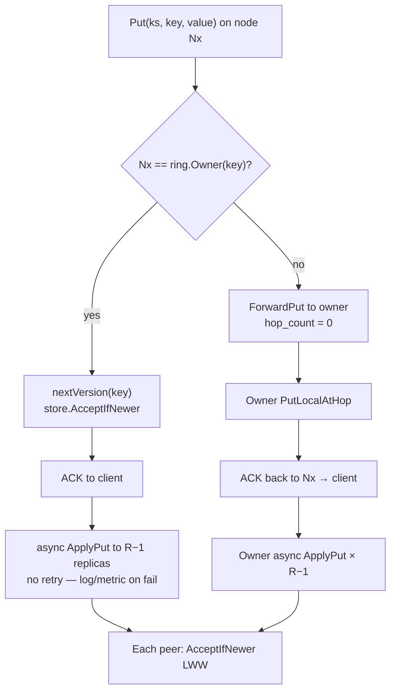

---

## Put — forward hop limit

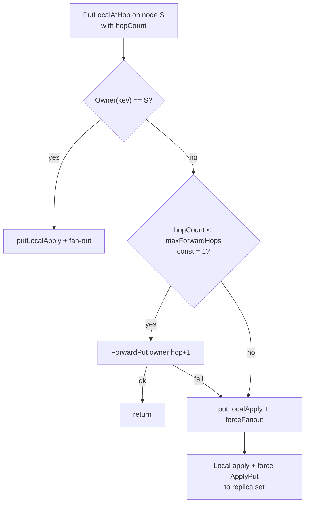

---

## PutMany

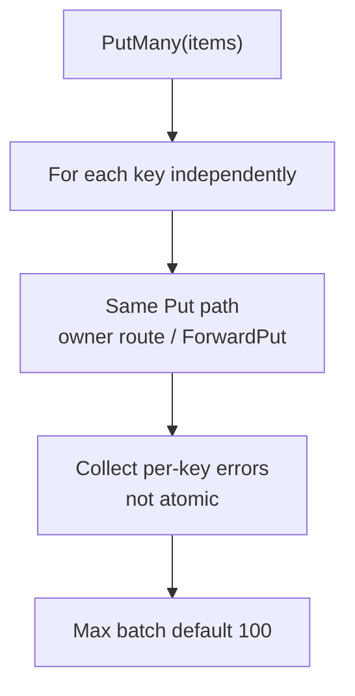

---

## Get

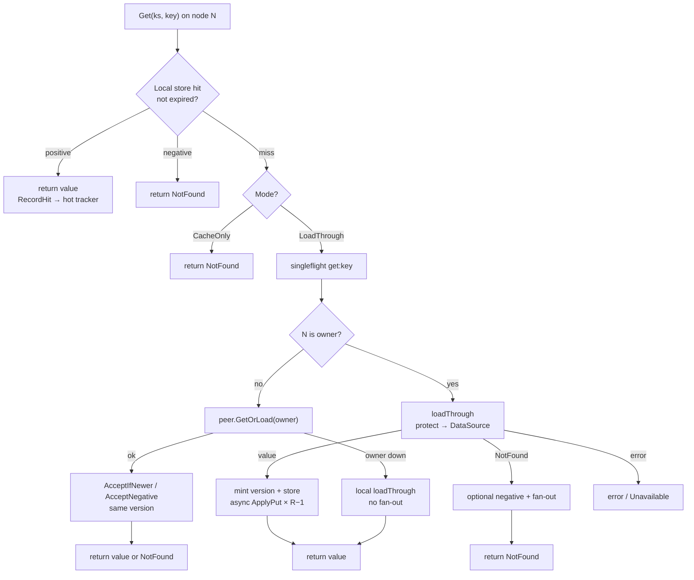

---

## Get — LoadThrough miss sequence

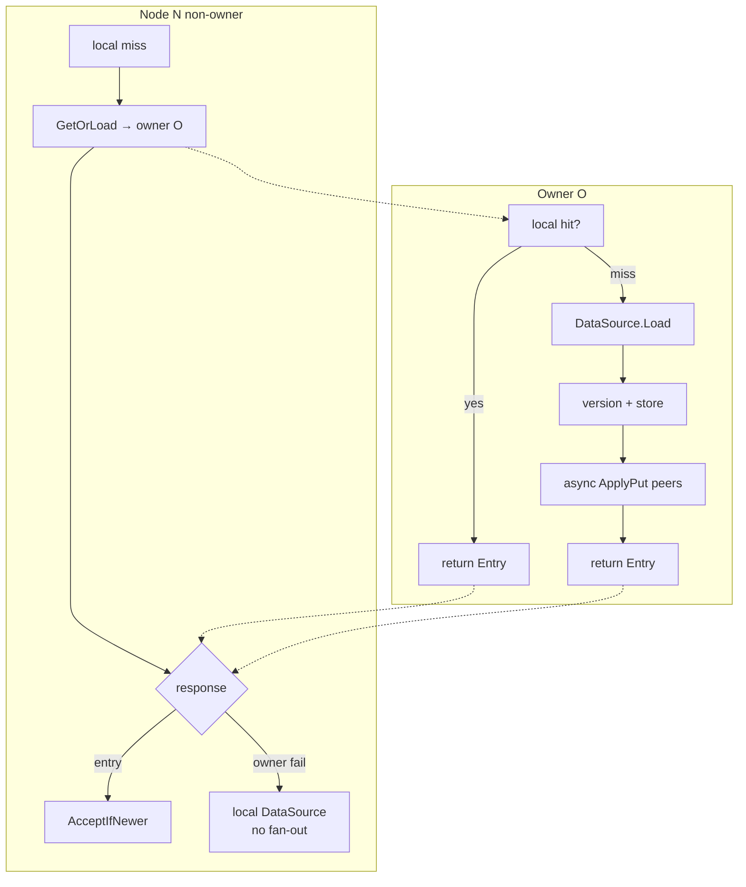

---

## Delete

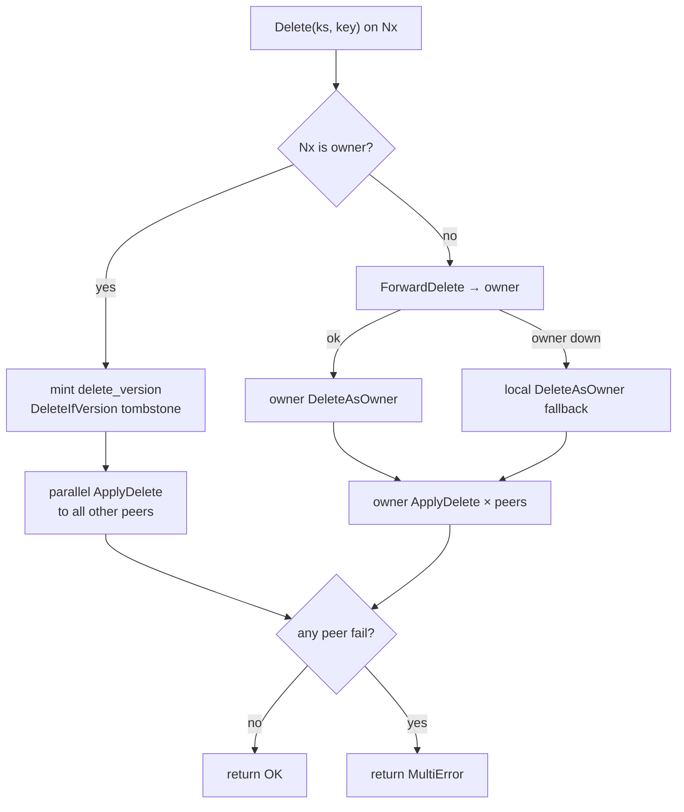

---

## Peer RPCs

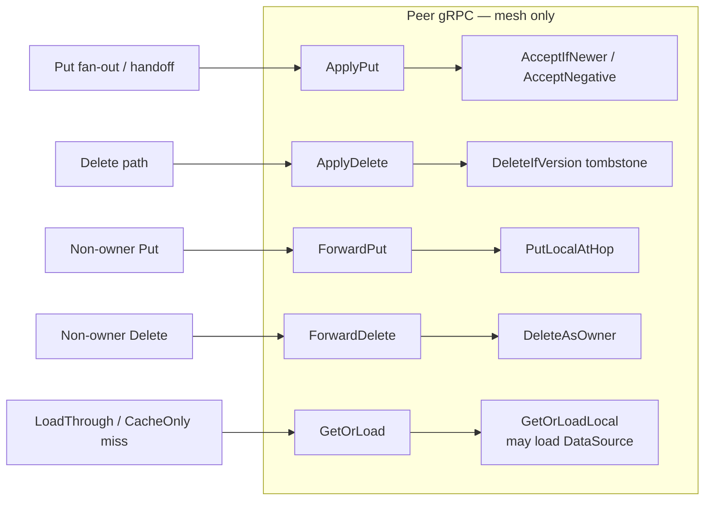

---

## Membership

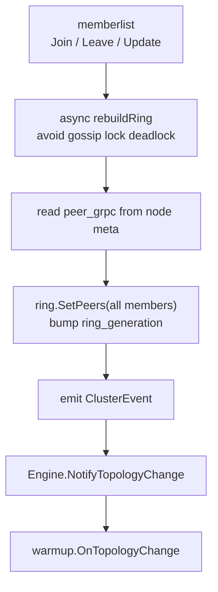

---

## Topology handoff — hot then rest

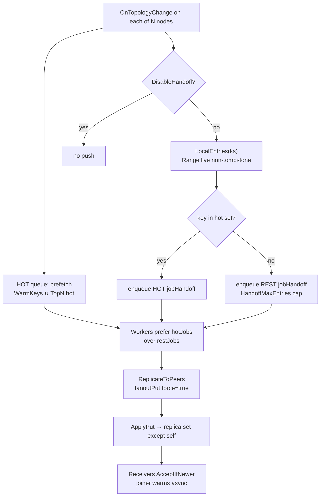

---

## Join N → N+1

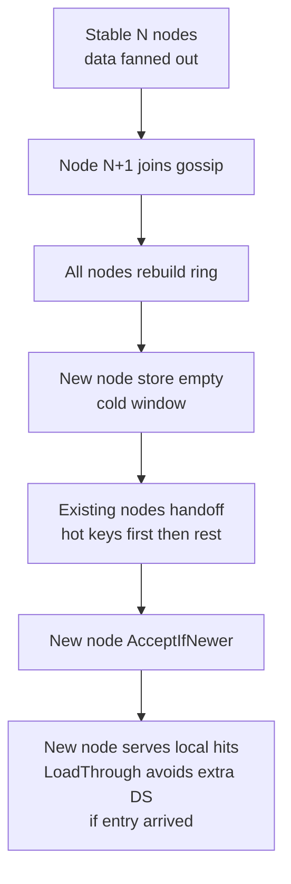

---

## Leave N → N−1

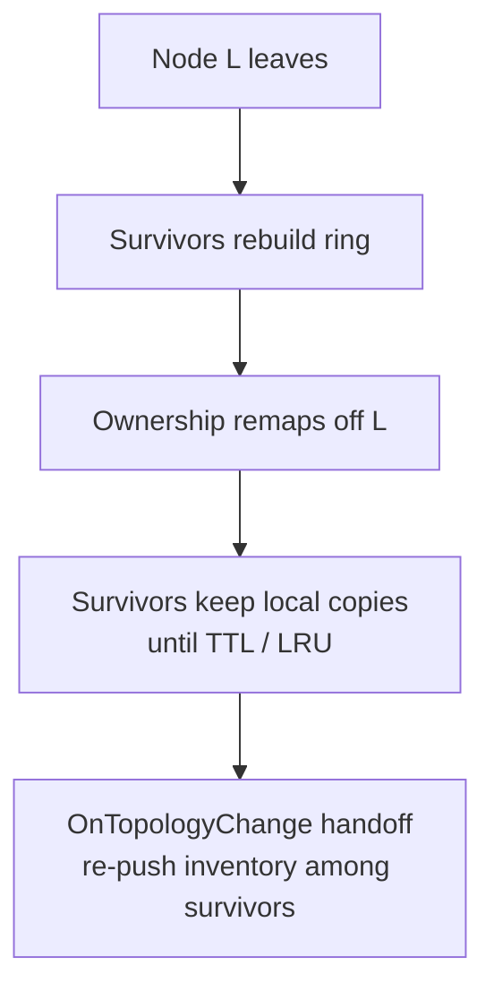

---

## Warmup & refresh-ahead

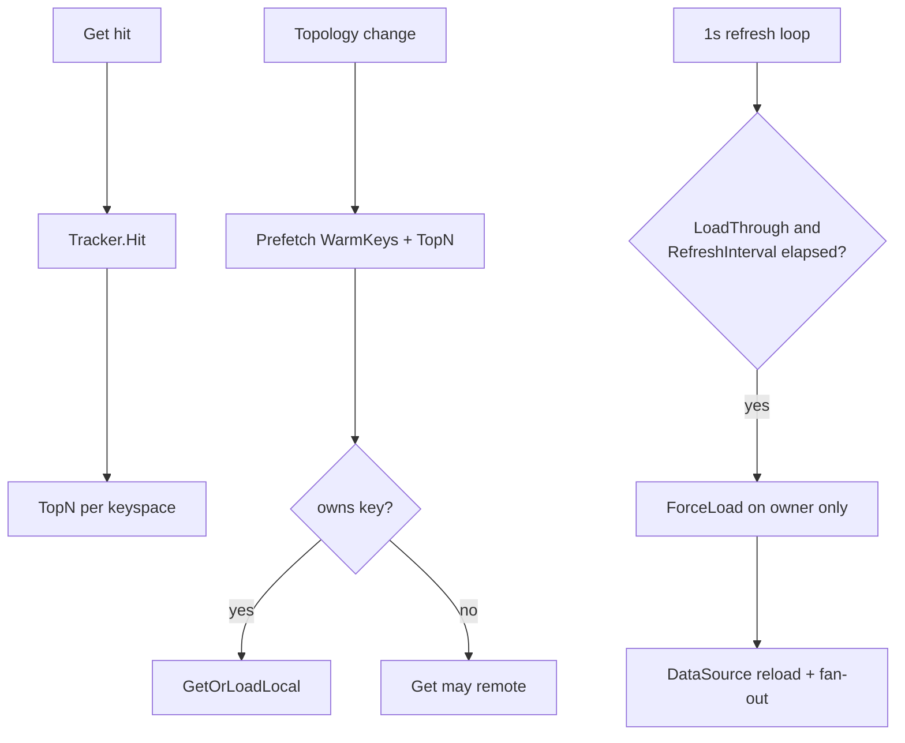

---

## Protect DataSource

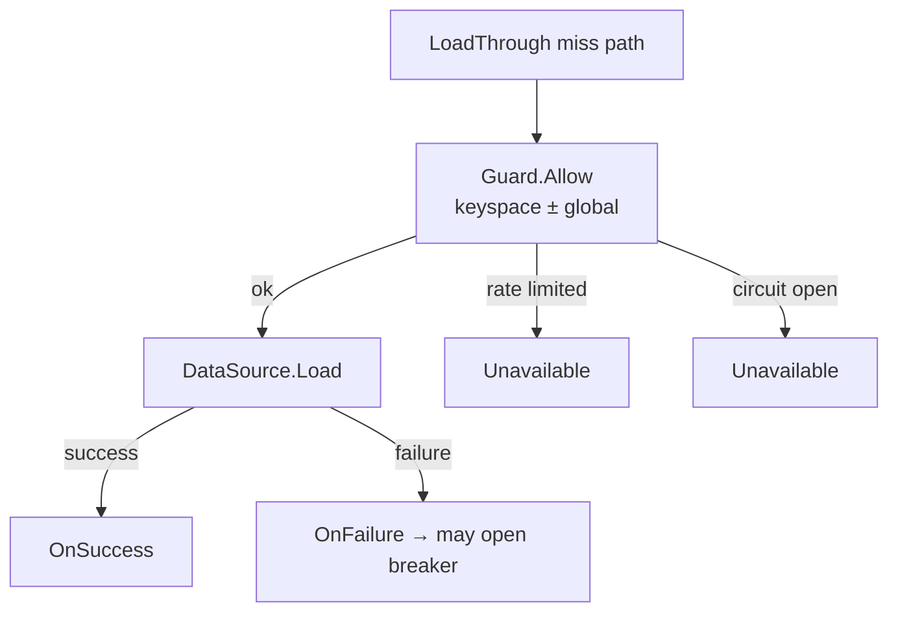

---

## End-to-end ops

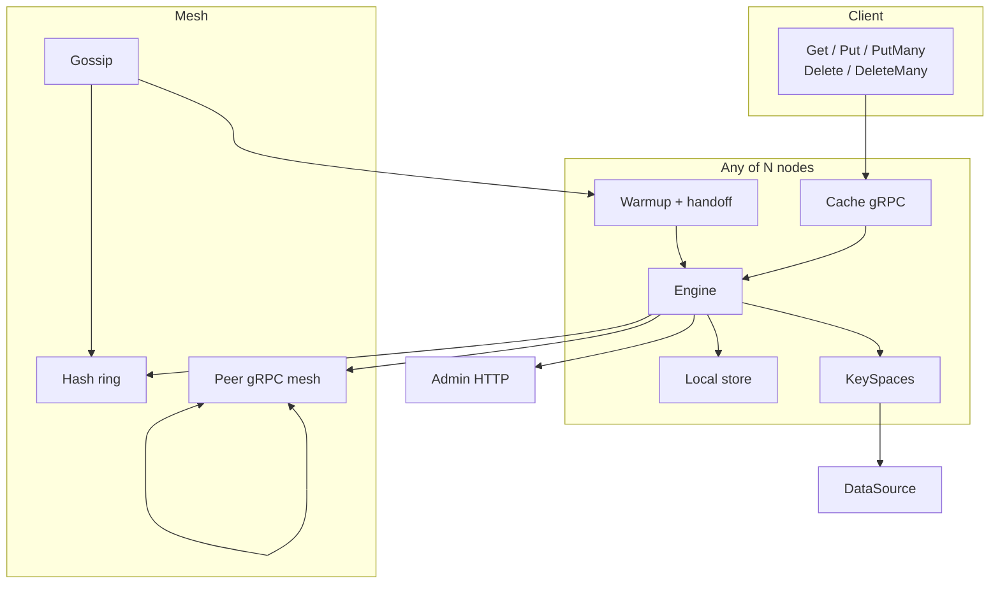

---

## Key lifecycle

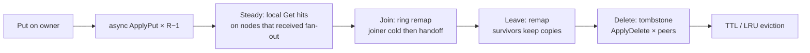

---

## Which path

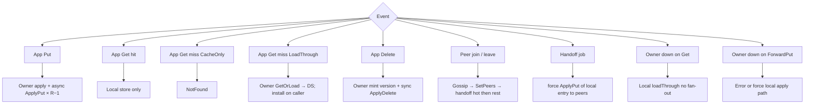
